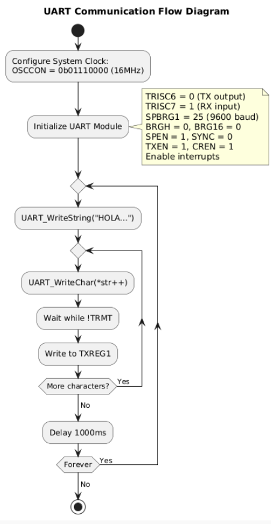
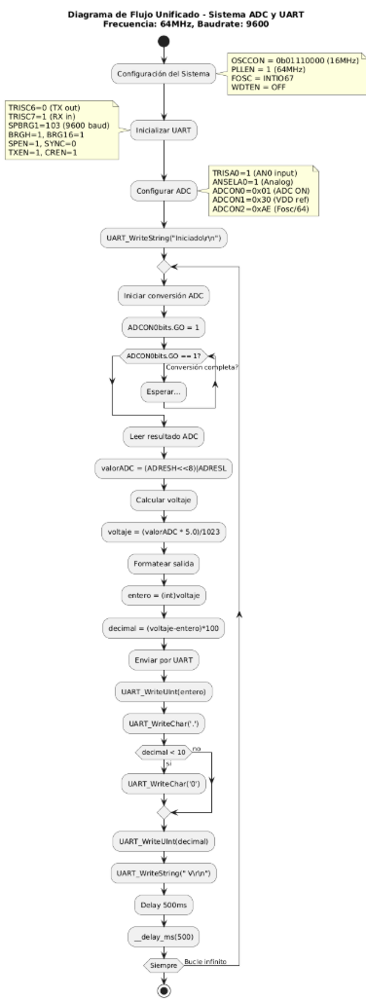

[](https://classroom.github.com/online_ide?assignment_repo_id=19574381&assignment_repo_type=AssignmentRepo)
# Lab04: Comunicación UART en PIC18F45K22

## Integrantes

[Jeisson Estiven Diaz Tequia - 131260](https://github.com/JeissonDi)

[Nicolas Joël Mila Moriones - 131356](https://github.com/Mikironi)

[Jhonatan Julian Galindo Ortiz - 128624](https://github.com/Jhonatan127galindo)

## Documentación

# **Introducción al Sistema Embebido con Microcontrolador PIC: Comunicación UART y Lectura ADC**

 **1. Contexto General**

Los microcontroladores PIC de Microchip son ampliamente utilizados en sistemas embebidos debido a su versatilidad, bajo consumo de energía y capacidad para interactuar con diversos periféricos. En este proyecto, se implementa un sistema basado en un microcontrolador PIC que integra dos funcionalidades esenciales en aplicaciones embebidas:  

1. **Comunicación UART (Universal Asynchronous Receiver-Transmitter)**: Permite la transmisión de datos en serie entre el microcontrolador y un dispositivo externo, como una computadora o un módulo Bluetooth.  
2. **Conversión Analógica-Digital (ADC)**: Facilita la lectura de señales analógicas (como las de un potenciómetro o sensor de temperatura) y su procesamiento en el dominio digital.  

El objetivo principal del sistema es realizar lecturas periódicas de una señal analógica, convertirla a un valor digital, procesarla y enviarla a través de la UART para su visualización en un monitor serial.  

---

 **2. Arquitectura del Sistema**

El sistema está estructurado en módulos independientes que interactúan entre sí:  

 **2.1. Configuración del Reloj y Frecuencia del Sistema**  
El microcontrolador opera con un oscilador interno configurado inicialmente a **16 MHz**, que luego se multiplica a **64 MHz** mediante un **PLL (Phase-Locked Loop)**. Esto permite un mejor desempeño en el procesamiento de datos y la generación de baud rates estables para la UART.  

```c
OSCCON = 0b01110000;   // Configura oscilador interno a 16 MHz
OSCTUNEbits.PLLEN = 1; // Habilita PLL para llevar la frecuencia a 64 MHz
```

 **2.2. Módulo UART para Comunicación Serial**  
La UART se configura para operar a **9600 baudios**, con las siguientes características:  
- **Modo asíncrono** (sin señal de reloj externa).  
- **Transmisión y recepción habilitadas**.  
- **Generador de baud rate de 16 bits** para mayor precisión.  
- **Interrupciones habilitadas** para recepción de datos.  

```c
SPBRG1 = 103;           // Baud rate de 9600 para 64 MHz
TXSTA1bits.BRGH = 1;    // Alta velocidad
BAUDCON1bits.BRG16 = 1; // Generador de 16 bits
RCSTA1bits.SPEN = 1;    // Habilita el puerto serial
TXSTA1bits.TXEN = 1;    // Habilita transmisión
RCSTA1bits.CREN = 1;    // Habilita recepción
```

Además, se implementan funciones para el envío de datos en diferentes formatos:  
- **Caracteres individuales (`UART_WriteChar`)**.  
- **Cadenas de texto (`UART_WriteString`)**.  
- **Números enteros (`UART_WriteUInt`)**.  
- **Valores de voltaje formateados (`UART_WriteVoltage`)**.  

 **2.3. Módulo ADC para Lectura de Señales Analógicas**  
El ADC se configura para leer señales en el **canal AN0 (RA0)**, con las siguientes características:  
- **Resolución de 10 bits** (rango de 0 a 1023).  
- **Tensión de referencia VDD (5V)**.  
- **Tiempo de adquisición y conversión optimizado**.  

```c
TRISA0 = 1;          // Configura RA0 como entrada
ANSELAbits.ANSA0 = 1; // Habilita RA0 como analógico
ADCON0 = 0b00000001;  // ADC ON, canal AN0 seleccionado
ADCON1 = 0b00110000;  // Justificación derecha, VDD como referencia
ADCON2 = 0b10101110;  // Configuración del tiempo de muestreo y reloj
```

La función `readADC()` realiza la conversión y devuelve el valor digital, mientras que `readVoltage()` lo convierte a un valor de voltaje real (0-5V).  

---

**3. Flujo de Operación del Sistema**

1. **Inicialización**:  
   - Configura el reloj a **64 MHz**.  
   - Inicializa la **UART** y el **ADC**.  
   - Envía un mensaje de inicio por UART (`"Sistema iniciado"`).  

2. **Bucle Principal**:  
   - Lee el valor del ADC con `readADC()`.  
   - Convierte el valor a voltaje (`(adcValue * 5.0) / 1023.0`).  
   - Formatea el voltaje como un string (ejemplo: `"3.25 V"`).  
   - Lo envía por UART cada **500 ms**.  

```c
while(1) {
    UART_WriteString("Voltaje: ");
    UART_WriteVoltage(readADC());
    UART_WriteString(" V\r\n");
    __delay_ms(500);
}
```

---

**4. Aplicaciones y Posibles Mejoras**

**Aplicaciones Típicas**  
- **Monitoreo de sensores** (temperatura, luz, humedad).  
- **Sistemas de adquisición de datos**.  
- **Interfaz con computadoras para visualización de datos**.  
- **Control de motores mediante señales PWM basadas en ADC**.  

 **Mejoras Futuras**  
- **Implementar recepción UART** para ajustar parámetros en tiempo real.  
- **Agregar más canales ADC** para leer múltiples sensores.  
- **Incorporar comunicación inalámbrica** (Bluetooth, WiFi) mediante módulos externos.  
- **Optimizar el código para bajo consumo** (modos sleep, wake-up por interrupciones).  

---

# **Análisis Detallado de los Códigos PIC con UART y ADC**
**1. main.c (Primera Versión - UART Básico)**

```c
#include <xc.h>       // Librería principal para PIC (contiene definiciones de registros)
#include "uart.h"     // Incluye el archivo de cabecera para funciones UART

// Palabras reservadas del compilador (#pragma config):
#pragma config FOSC = INTIO67  // Configura oscilador interno en RA6/RA7
#pragma config WDTEN = OFF     // Desactiva Watchdog Timer
#pragma config LVP = OFF       // Desactiva Low Voltage Programming

void main(void) {
    OSCCON = 0b01110000;  // Configura oscilador interno a 16MHz (IRCF=111)
    UART_Init();          // Llama a la función de inicialización UART

    while(1) {            // Bucle infinito
        UART_WriteString("Hola, UART funcionando!\r\n");  // Envía mensaje
        __delay_ms(1000); // Retardo de 1 segundo (usando macro __delay_ms)
    }
}
```

 **Funcionamiento:**
1. Configura el microcontrolador para usar oscilador interno.
2. Inicializa la UART.
3. Envía un mensaje cada segundo en un bucle infinito.

 **Palabras reservadas clave:**
- `#pragma config`: Directiva para configuración de fusibles.
- `__delay_ms()`: Macro para retardos en milisegundos (requiere `_XTAL_FREQ`).

---
**2. uart.h (Primera Versión)**

```c
#ifndef UART_H      // Guarda de inclusión (evita duplicados)
#define UART_H      // Define el símbolo UART_H

#include <xc.h>     // Librería PIC
#include <stdint.h> // Para tipos de datos como uint16_t

#define _XTAL_FREQ 16000000UL  // Frecuencia del sistema para retardos

// Prototipos de funciones:
void UART_Init(void);               // Inicializa UART
void UART_WriteChar(char data);     // Envía un carácter
void UART_WriteString(const char* str); // Envía cadena
void UART_WriteUInt(uint16_t value);    // Envía entero sin signo
void UART_WriteVoltage(uint16_t adcValue); // Formatea voltaje

#endif             // Fin del guarda de inclusión
```

 **Estructura:**
- Encapsula las declaraciones de funciones UART.
- `#ifndef/#define/#endif` previene inclusiones múltiples.

---

**3. uart.c (Primera Versión)**

```c
#include "uart.h"
#include <stdio.h>  // Para posibles funciones de formato

void UART_Init(void) {
    TRISC6 = 0; // Configura TX (RC6) como salida
    TRISC7 = 1; // Configura RX (RC7) como entrada

    SPBRG1 = 25; // Baud rate 9600 para 16MHz (BRGH=0, BRG16=0)
    TXSTA1bits.BRGH = 0; // Modo baja velocidad
    BAUDCON1bits.BRG16 = 0; // Generador de 8 bits

    RCSTA1bits.SPEN = 1; // Habilita puerto serial
    TXSTA1bits.SYNC = 0; // Modo asíncrono
    TXSTA1bits.TXEN = 1; // Habilita transmisión
    RCSTA1bits.CREN = 1; // Habilita recepción

    // Configuración de interrupciones:
    PIE1bits.RC1IE = 1;   // Interrupción por recepción
    PIR1bits.RC1IF = 0;   // Limpia bandera
    INTCONbits.PEIE = 1;  // Habilita interrupciones periféricas
    INTCONbits.GIE = 1;   // Habilita interrupciones globales
}

void UART_WriteChar(char data) {
    while (!TXSTA1bits.TRMT); // Espera buffer TX vacío
    TXREG1 = data;           // Escribe dato en registro
}

void UART_WriteString(const char* str) {
    while (*str) {           // Recorre cadena hasta NULL
        UART_WriteChar(*str++); // Envía cada carácter
    }
}
```

 **Funcionamiento UART_Init():**
1. Configura pines TX/RX.
2. Calcula baud rate (`SPBRG1 = 25` para 9600 bauds a 16MHz).
3. Habilita módulo serial y transmisión/recepción.
4. Configura interrupciones.

 **Palabras reservadas clave:**
- `bits`: Acceso a bits individuales en registros SFR.
- `while (!TXSTA1bits.TRMT)`: Espera activa hasta que el buffer esté vacío.

---

**4. main.c (Segunda Versión - con ADC)**

```c
#include <xc.h>
#include "ADC_POT1.h"  // Cabecera para funciones ADC
#include "uart.h"

#pragma config FOSC = INTIO67   // Oscilador interno
#pragma config PLLCFG = ON      // Habilita PLL (x4)
#pragma config WDTEN = OFF      // Watchdog off
#pragma config LVP = OFF        // Low Voltage Programming off

#define _XTAL_FREQ 64000000UL   // Nueva frecuencia (PLL activo)

void main(void) {
    OSCCON = 0b01110000;    // 16MHz inicial
    OSCTUNEbits.PLLEN = 1;   // Activa PLL (64MHz final)
    
    UART_Init();     // Inicializa UART a nuevo baud rate
    setupADC();      // Configura ADC

    UART_WriteString("Sistema iniciado\r\n");
    
    while(1) {
        UART_WriteString("Voltaje: ");
        UART_WriteVoltage(readADC()); // Lee y formatea voltaje
        UART_WriteString(" V\r\n");
        __delay_ms(500);    // Retardo entre lecturas
    }
}
```

 **Diferencias con primera versión:**
- Ahora usa PLL para 64MHz.
- Integra lectura ADC con visualización por UART.
- `UART_WriteVoltage()` formatea el valor analógico.

---

**5. ADC.h y ADC.c**

**ADC.h**
```c
#ifndef ADC_H
#define ADC_H

#include <xc.h>

#define VREF 5.0        // Tensión de referencia

void setupADC(void);            // Configura hardware ADC
unsigned int readADC(void);     // Lee valor digital (0-1023)
float readVoltage(void);        // Convierte a voltaje (0-5V)

#endif
```

 **ADC.c**
```c
#include "ADC.h"

void setupADC(void) {
    TRISA0 = 1;         // RA0 como entrada
    ANSELAbits.ANSA0 = 1; // Habilita RA0 como analógico
    ADCON0 = 0b00000001; // ADC ON, canal AN0
    ADCON1 = 0b00110000; // Justificación derecha, VDD/VSS como referencia
    ADCON2 = 0b10101110; // Tiempo de adquisición 12 TAD, Fosc/64
}

unsigned int readADC(void) {
    ADCON0bits.GO = 1;      // Inicia conversión
    while(ADCON0bits.GO);   // Espera fin de conversión
    return ((ADRESH << 8) | ADRESL); // Retorna valor 10-bit
}

float readVoltage(void) {
    return (readADC() * VREF) / 1023.0; // Conversión a voltaje
}
```

 **Funcionamiento ADC:**
1. `setupADC()` configura:
   - Pin RA0 como entrada analógica.
   - Tiempos de muestreo y reloj del ADC.
2. `readADC()` inicia conversión y devuelve valor crudo (10 bits).
3. `readVoltage()` escala el valor a voltaje (0-5V).

 **Registros clave:**
- `ADCON0`: Control del ADC (encendido, inicio de conversión).
- `ADCON1`: Configuración de justificación y VREF.
- `ADRESH/ADRESL`: Registros donde se almacena el resultado.

---

 **6. Palabras Reservadas y Directivas Más Importantes**

| **Palabra/Directiva** | **Función** |
|-----------------------|-------------|
| `#include` | Incluye archivos de cabecera |
| `#pragma config` | Configura fusibles del PIC |
| `#define` | Define macros y constantes |
| `void` | Indica función sin retorno |
| `unsigned int` | Entero sin signo |
| `bits` | Acceso a bits en registros SFR |
| `__delay_ms()` | Macro para retardos |
| `while(1)` | Bucle infinito |
| `TRISx` | Configura dirección de pines (1=entrada) |
| `ANSELx` | Habilita pines como analógicos |


### diagrama de flujo 



### diagrama de flujo 



## Implmentación

- Con la uart no la podimos integrar ya que al realizar el respectivo laboratoria funcionaba solo el codigo que nos envio la profesora, pero al integrar el adc en el programa de putty no se veia reflejado nada se vei el cursor no mas y ni se movia y al intentar con el codigo de la profesora ya no se veia reflajado nada.
